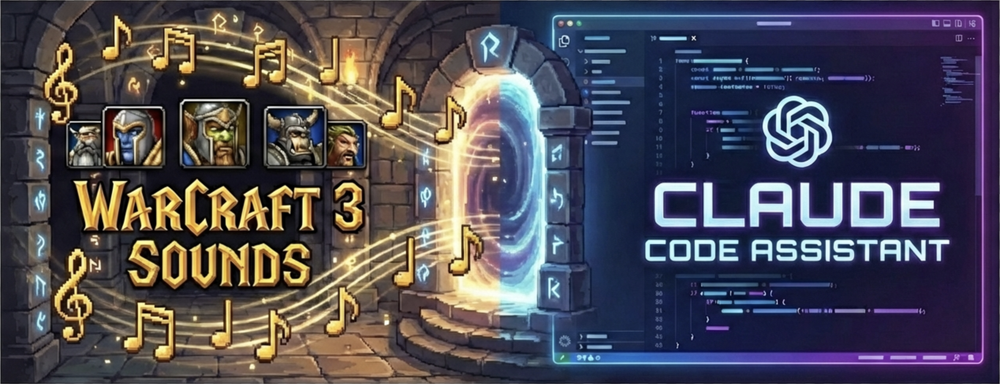

# claudecode-sounds

> *"Your sound card works perfectly."*

The spirits of Azeroth now herald your coding endeavors. When Claude Code requires your counsel, the ancient sounds of Warcraft III shall summon you back to the battlefield of code.

## The Call to Arms

- **Question Sound** — *"My liege?"* — Claude seeks your wisdom
- **Complete Sound** — *"Job's done!"* — Your task stands victorious
- **Error Sound** — *"That was a mistake."* — Dark forces have intervened
- **Permission Sound** — *"Are you sure?"* — Authorization required, Commander

## Available Soundpacks

| Soundpack | Description |
|-----------|-------------|
| `warcraft3-en` | Warcraft 3 (English) — *default* |
| `warcraft3-ru` | Warcraft 3 (Русский) |

## Summoning the Plugin

### From the Marketplace (Recommended)

```bash
# Add the marketplace
/plugin marketplace add newink/codingagents

# Summon the plugin
/plugin install claudecode-sounds@codingagents
```

### Manual Summoning

```bash
# Channel the plugin directly
claude --plugin-dir /path/to/claudecode-sounds
```

Or bind it to your project stronghold:
```bash
cp -r claudecode-sounds /your/project/.claude-plugin/
```

## Battle Commands

| Command | Effect |
|---------|--------|
| `/sounds` | Display current soundpack and test the war horns |
| `/sounds-set <name>` | Switch soundpacks (e.g., `/sounds-set warcraft3-ru`) |
| `/soundpack-create` | Forge a new custom soundpack |

## Configuration Scroll

Your settings are inscribed in `.claude/claudecode-sounds.local.md`:

```markdown
---
soundpack: warcraft3-en
---
```

## Forging Custom Soundpacks

Craft your own legendary soundpack:

1. Create a new stronghold in `soundpacks/` with your pack name
2. Arm it with these sound files (WAV format):
   - `question.wav` — The call for guidance
   - `complete.wav` — The victory fanfare
   - `error.wav` — The cry of defeat
   - `permission.wav` — The request for authority
3. Inscribe the `soundpack.json` manifest:
   ```json
   {
     "name": "My Legendary Soundpack",
     "description": "Sounds forged in the fires of Mount Hyjal",
     "sounds": {
       "question": "question.wav",
       "complete": "complete.wav",
       "error": "error.wav",
       "permission": "permission.wav"
     }
   }
   ```

## System Requirements

### macOS
The native `afplay` enchantment suffices. No additional artifacts required.

### Linux
One of these audio conduits: `paplay` (PulseAudio), `aplay` (ALSA), `mpv`, or `ffplay`

### Windows
PowerShell (built-in sorcery) or `mpv`

---

*"What is it now?"*

## License

Sound files from Warcraft 3 are property of Blizzard Entertainment. For the Horde! (And the Alliance, we suppose.)
